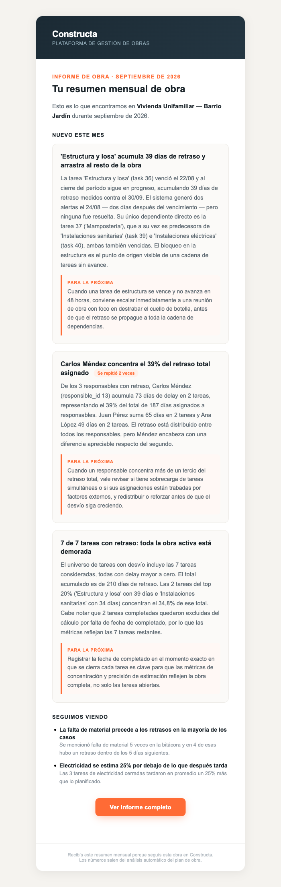
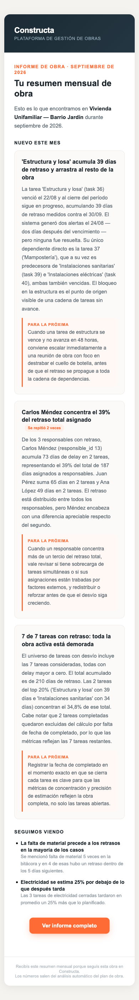
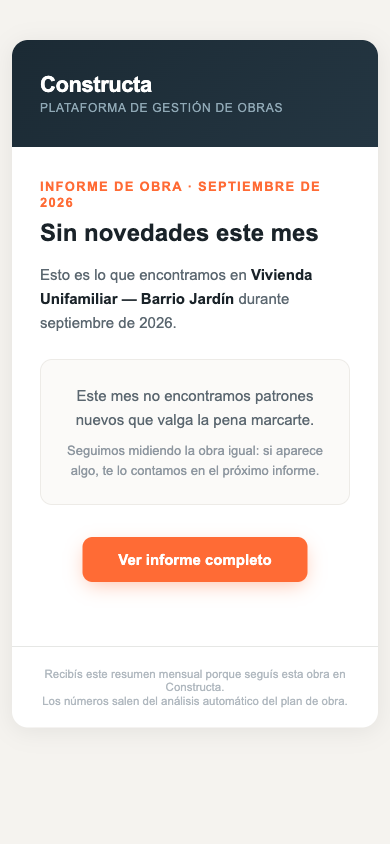
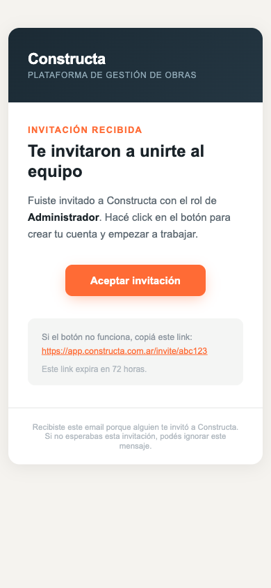

# Motor de insights — Etapa 4: renderizado del email

> **Estado:** implementado (rama `feat/insights-etapa-2-estadisticas`).
> **Alcance:** convertir las conclusiones ya generadas por la [etapa 3](insights-etapa-3-redaccion.md) en un string HTML de email. **Presentación pura** — no toca la lógica de generación ni implementa el envío (etapa 5).
> **Entrada:** una lista de `ObraInsight` ya guardados. **Salida:** un `str` con el HTML.

---

## 1. Qué se hizo

| Pieza | Archivo |
|---|---|
| Helper de layout compartido | `backend/app/services/email_service.py` → `_email_shell()` |
| Builder del email de insights | `backend/app/services/email_service.py` → `build_insights_email_html()` |
| Script de vista previa | `backend/scripts/preview_insights_email.py` |
| HTML de ejemplo (abrir en el navegador) | `docs/features/samples/insights-email-ejemplo.html` |
| HTML del caso sin novedades | `docs/features/samples/insights-email-sin-novedades.html` |
| Tests | `backend/tests/test_email_render.py` (18 tests) |

```bash
python scripts/preview_insights_email.py           # 3 nuevas + 2 en seguimiento
python scripts/preview_insights_email.py --vacio   # caso sin conclusiones
```

Los textos del ejemplo son las **conclusiones reales** que generó la etapa 3 sobre la obra #5, no lorem ipsum: la vista previa muestra el largo y el tono que produce la IA de verdad.

---

## 2. El helper `_email_shell`

No existía. Se extrajo del template de invitación, que la auditoría 01 §8.8 señalaba como el mejor logrado de los cuatro (table-based compatible con Outlook, viewport meta, header con gradient, CTA grande, footer), y se dejó como base reutilizable.

```python
_email_shell(
    title, body_html, cta_url=None, cta_label=None, *,
    eyebrow=None, cta_note=None, cta_fallback=True, footer_html=None,
) -> str
```

El shell arma: `<head>` con charset y viewport → header de marca con gradient → eyebrow → `<h1>` → `body_html` → botón CTA → caja de "si el botón no funciona, copiá este link" → footer.

La caja de fallback la arma el shell junto con el CTA porque son la misma preocupación: que el usuario llegue al destino aunque su cliente de correo le coma el botón. Se puede apagar con `cta_fallback=False` (el email de insights la apaga: su CTA no es un link con token de un solo uso, así que repetir la URL completa solo suma ruido).

### Confirmación de que la invitación no cambió

Se capturó el HTML del template **antes** de tocar nada, se refactorizó, y se comparó:

```
$ diff /tmp/invite_before.html /tmp/invite_after.html
✓ IDENTICO byte a byte (admin)
✓ IDENTICO byte a byte (collaborator)
```

O sea: el refactor a `_email_shell` **no cambió ni un carácter** del email de invitación.

Después, y por separado, se hizo un cambio deliberado de layout que sí toca la invitación — está explicado abajo en §4.

---

## 3. El email de insights

`build_insights_email_html(obra_id, obra_name, period, insights, frontend_url=None)`.

Recibe objetos con los atributos de `ObraInsight` (`title`, `description`, `recommendation`, `status`, `reinforcement_count`, `last_period`). Es duck-typing a propósito: el servicio de emails no importa modelos de SQLAlchemy, y los tests pueden pasar objetos simples.

### Estructura

1. **Saludo** con el nombre de la obra y el período en castellano (`"2026-09"` → `"septiembre de 2026"`).
2. **"Nuevo este mes"** — conclusiones cuyo `last_period == period`, es decir las que nacieron o se reforzaron en este ciclo. Se muestran en tarjeta completa: título, badge *"Se repitió N veces"* si tiene refuerzos, **la narrativa íntegra tal cual la escribió la IA**, y el bloque *"Para la próxima"* con la recomendación si la hay.
3. **"Seguimos viendo"** — activas de meses anteriores (`last_period != period`), en lista compacta: título + una línea.
4. **CTA** "Ver informe completo" → `{FRONTEND_URL}/obras/{obra_id}/insights`.
5. **Footer** con el mismo estilo que el resto del sistema.

Las conclusiones en estado `descartada` **nunca** entran. Solo entran `nueva`, `vista` y `aplicada`.

### Sobre el resumen de "Seguimos viendo"

El pedido tenía dos requisitos en tensión: mostrar las de seguimiento *"más resumidas (solo título + una línea)"* y a la vez *"no la resumas ni la reescribas"*.

Se resolvió **cortando, no reformulando**: `_first_sentence()` toma la **primera oración textual** de la descripción (recorte en el primer `.!?`, con tope de 160 caracteres y elipsis si se pasa). Lo que se ve es literalmente texto de la IA — la etapa 4 no genera ni edita contenido, solo muestra menos.

### Caso sin conclusiones

Si no hay ninguna activa, el email **no sale vacío ni con secciones en blanco**: cambia el título a "Sin novedades este mes" y dice explícitamente:

> Este mes no encontramos patrones nuevos que valga la pena marcarte.
> Seguimos midiendo la obra igual: si aparece algo, te lo contamos en el próximo informe.

El CTA se mantiene, para que el jefe pueda entrar igual a ver los números.

### Escapado

Los textos vienen de un modelo de lenguaje, así que se escapan `&`, `<` y `>` antes de meterlos en el HTML. Sin esto, una conclusión que mencione `5 < 7` o que contenga markup rompería el email (o algo peor). Hay test.

---

## 4. Verificación visual

Renderizado en Chromium a través del script de vista previa.

### Desktop (700px)



### Mobile (390px, iPhone)



### Sin novedades



### Un bug real encontrado en esta verificación

La primera versión heredaba del template de invitación una tabla de **ancho fijo `520px`**. Medido en el navegador a 390px de viewport:

```json
{ "viewport": 390, "scrollWidth": 520, "hayScrollHorizontal": true }
```

Es decir: **scroll horizontal en el teléfono**, que es donde se abre la mayoría de los emails. El viewport meta estaba (no se repitió el bug de reset/verificación que marca el audit), pero el ancho fijo desbordaba igual.

**Corrección aplicada al shell:** la tabla pasó de `width="520"` a `width="100%"` con `style="max-width:520px"`, se agregó `padding:0 12px` al contenedor y el padding lateral interno bajó de 40px a 28px. Medición después del cambio:

```json
{ "viewport": 390, "scrollWidth": 390, "hayScrollHorizontal": false, "anchoTarjeta": 366 }
```

**Esto sí toca el email de invitación**, y es un cambio deliberado, no un descuido: el shell es compartido y su razón de ser es que todos los emails se vean igual de bien. En desktop la invitación se ve idéntica (el `max-width:520px` la deja en los mismos 520px); en mobile ahora entra en pantalla en vez de desbordar. El diff exacto sobre la invitación es de 4 líneas, todas de layout, ninguna de contenido:

| Antes | Ahora |
|---|---|
| `<td align="center">` | `<td align="center" style="padding:0 12px;">` |
| `<table width="520" …>` | `<table width="100%" style="max-width:520px; …">` |
| `padding:32px 40px` (header) | `padding:32px 28px` |
| `padding:36px 40px` (cuerpo) | `padding:32px 28px` |
| `padding:20px 40px` (footer) | `padding:20px 28px` |

Captura de la invitación después del refactor + fluidez:



Si preferís que la invitación quede exactamente como estaba (fija en 520px) y que solo el email de insights sea fluido, se resuelve con un flag en el shell — pero convivirían dos layouts en el helper que existe justamente para unificarlos.

---

## 5. Dependencia pendiente: la ruta `/obras/{obra_id}/insights`

**El CTA apunta a una página que no existe, y el frontend hoy no puede resolver esa URL.** No es solo que falte la pantalla:

- El proyecto **no usa React Router** (`CLAUDE.md`: *"Routing por estado (App.tsx): `selectedObra: Obra | null`, NO React Router"*). Se confirmó: no hay dependencia de router ni definición de rutas en `frontend/src`.
- `App.tsx` interpreta a mano exactamente **tres** rutas con `window.location.pathname.match`: `/invite/:token`, `/reset-password/:token` y `/verify-email/:token`. Todo lo demás cae en la app con estado.
- No hay ninguna referencia a `insights` en el frontend.

**Consecuencia concreta:** hoy, un click en "Ver informe completo" abre la app en el estado inicial (el portfolio), **no** en el informe de la obra. No tira 404 — que es peor, porque el usuario no entiende por qué no ve lo que le prometía el email.

Para que el CTA sirva hacen falta dos cosas, ninguna en el alcance de esta etapa:
1. La pantalla de detalle de insights de una obra.
2. Que `App.tsx` sepa resolver `/obras/:id/insights` (agregar el match manual como los otros tres, o incorporar un router de verdad).

El link se dejó apuntando ahí igual, como se pidió, para no tener que tocar el email cuando la pantalla exista.

---

## 6. Otros pendientes y notas

- **Reset y verificación siguen sin usar el shell.** La auditoría recomendaba homogeneizar los cuatro templates; esta etapa migró solo la invitación, que era lo pedido. Los dos siguen sin viewport meta y sin el header de marca. Hay un test (`test_todos_los_emails_del_shell_traen_viewport_meta`) que deja ese estado **documentado en código**, no silenciado: afirma que la invitación y el de insights sí lo tienen, y que reset/verificación todavía no. Migrarlos es un cambio chico ahora que el shell existe.
- **No hay función de envío.** Esta etapa termina en el string HTML, como se pidió. `send_insights_email(...)` es de la etapa 5.
- **Antes de que esto sirva en producción** hay que resolver lo de dominio/SPF/DKIM del audit 01 §8.5: hoy el sender es `2226370@ucc.edu.ar` y los emails van a spam. Además, `FRONTEND_URL` no está en el `.env` (cae al default `http://localhost:5173`), así que el CTA saldría con un link a localhost — hay que setearlo junto con el resto.
- **La cuenta de Brevo tiene restricción por IP** (detectado en esta sesión al probar una invitación real): devuelve `401 unauthorized` desde una IP no autorizada. Hay que agregar la IP del servidor en el panel de Brevo antes del despliegue.

---

## 7. Pruebas

`backend/tests/test_email_render.py` — **18 tests**, todos verdes. Cubren un hueco que marcaba el audit 01 §8.9: no había ningún test sobre el HTML de los emails, así que romper un template no rompía la suite.

| Grupo | Qué verifica |
|---|---|
| Shell / invitación | Que la invitación conserve título, eyebrow, rol, CTA, link, expiración y footer tras el refactor; que distinga admin de colaborador; que siga siendo table-based con el header de marca |
| Layout | Que los emails del shell traigan viewport meta (y que reset/verificación todavía no, dejando el estado documentado); que no haya ancho fijo de 520px |
| Contenido | Saludo con obra y período en castellano; narrativa de las nuevas **íntegra palabra por palabra**; bloque de recomendación presente solo si existe; badge de refuerzos en singular y plural |
| Seguimiento | Que se muestre solo la primera oración y **no** el resto de la narrativa; recorte sin reescritura |
| Reglas | Descartadas excluidas; solo-seguimiento no dibuja sección vacía; sin conclusiones aparece el mensaje explícito; solo-descartadas cae en el estado vacío |
| Seguridad | Escapado de HTML en textos que vienen de la IA |
| CTA | Que apunte a `/obras/{id}/insights` con el `obra_id` correcto |

```
$ python -m pytest tests/test_email_render.py -q
18 passed

$ python -m pytest -q          # suite completa, sin regresiones
361 passed
```

Un bug propio encontrado por estos tests: `_first_sentence()` devolvía la oración con un espacio al final (`"Una sola. "`), porque el corte incluía el separador. Corregido.
